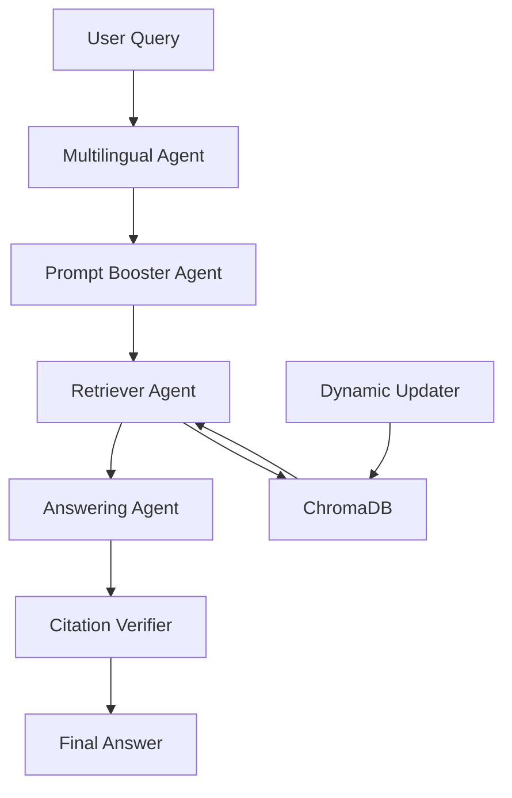

# 🏛️ Agentic Legal RAG System

**Production-Ready Multi-Agent Legal Research System for Indian Law**

A sophisticated agentic RAG (Retrieval-Augmented Generation) system that uses multiple specialized AI agents to provide comprehensive legal research and analysis. Built with modern Python frameworks and designed for production deployment.

## 🎯 System Overview

The Agentic Legal RAG System consists of 6 specialized agents working together:

1. **🎯 Orchestrator Agent** - Central coordinator managing all agents
2. **🚀 Prompt Booster Agent** - Enhances queries using Flan-T5 SLM
3. **🔍 Retriever Agent** - Retrieves documents from existing ChromaDB
4. **📝 Answering Agent** - Generates answers using LLM (Groq/OpenAI)
5. **✅ Citation Verifier** - Verifies claims using semantic similarity
6. **🌐 Multilingual Agent** - Handles Indian language queries
7. **🔄 Dynamic Updater** - Keeps legal database current

## 🚀 Quick Start

### 1. Prerequisites

```bash
# Python 3.10+ required
python --version

# Create virtual environment
python -m venv venv
source venv/bin/activate  # On Windows: venv\Scripts\activate

# Install dependencies
pip install -r requirements.txt
```

### 2. Configuration

Edit `config.py` and set your API keys:

```python
# API Keys (REQUIRED)
GROQ_API_KEY = "your_groq_api_key_here"
OPENAI_API_KEY = "your_openai_api_key_here"  # Optional
INDIAN_KANOON_API_KEY = "your_indian_kanoon_key_here"  # Optional

# Model Configuration
LLM_ANSWERING_MODEL = "llama3-8b-8192"  # Groq model
BOOSTER_MODEL_NAME = "google/flan-t5-small"  # SLM for query enhancement
EMBEDDING_MODEL_NAME = "sentence-transformers/all-MiniLM-L6-v2"
```

### 3. Test the System

```bash
# Run system tests
python test_system.py

# Expected output: All tests should pass
```

### 4. Launch the Application

```bash
# Start the Streamlit interface
streamlit run app.py

# Open browser to http://localhost:8501
```

## 🔧 API Integration Points

### Required APIs

#### 1. Groq API (Primary LLM)
- **Purpose**: Answer generation and legal analysis
- **Setup**: Get API key from [Groq Console](https://console.groq.com/)
- **Configuration**: Set `GROQ_API_KEY` in `config.py`
- **Models**: `llama3-8b-8192`, `llama3-70b-8192`, `mixtral-8x7b-32768`

#### 2. Sentence Transformers (Embeddings)
- **Purpose**: Document and query embeddings
- **Setup**: Automatically downloaded on first use
- **Models**: `all-MiniLM-L6-v2`, `law-ai/InLegalBERT`

### Optional APIs

#### 3. OpenAI API (Alternative LLM)
- **Purpose**: Alternative to Groq for answer generation
- **Setup**: Get API key from [OpenAI Platform](https://platform.openai.com/)
- **Configuration**: Set `OPENAI_API_KEY` in `config.py`

#### 4. Indian Kanoon API (Legal Data)
- **Purpose**: Real-time legal data updates
- **Setup**: Contact Indian Kanoon for API access
- **Configuration**: Set `INDIAN_KANOON_API_KEY` in `config.py`

#### 5. Translation APIs (Multilingual Support)
- **Purpose**: Translate Indian language queries
- **Options**: Google Translate, Azure Translator, AWS Translate
- **Configuration**: Add translation API keys to `config.py`

## 📁 Project Structure

```
agentic_legal_rag/
├── 🎯 orchestrator.py          # Central coordinator
├── 🚀 booster_agent.py         # Query enhancement (SLM)
├── 🔍 retriever_agent.py       # Document retrieval
├── 📝 answering_agent.py       # Answer generation (LLM)
├── ✅ citation_verifier.py     # Claim verification
├── 🌐 multilingual_agent.py    # Language processing
├── 🔄 updater.py              # Dynamic data updates
├── ⚙️ config.py               # Configuration
├── 🚀 app.py                  # Main application
├── 🧪 test_system.py          # System tests
├── 📋 requirements.txt        # Dependencies
└── 📚 README_COMPLETE.md      # This file
```

## 🔄 System Workflow



## 🎛️ Configuration Options

### Model Settings
```python
# LLM Configuration
LLM_ANSWERING_MODEL = "llama3-8b-8192"  # Groq model
BOOSTER_MODEL_NAME = "google/flan-t5-small"  # SLM
EMBEDDING_MODEL_NAME = "sentence-transformers/all-MiniLM-L6-v2"

# Retrieval Settings
RETRIEVAL_K = 10  # Number of documents to retrieve
CITATION_THRESHOLD = 0.7  # Minimum confidence for citations
```

### Database Settings
```python
# ChromaDB Configuration
CHROMA_DB_PATH = "../Indian-Law-Voicebot/chroma_db_"
COLLECTION_NAME = "vector_database"
```

## 🧪 Testing

### Run All Tests
```bash
python test_system.py
```

### Individual Component Tests
```bash
# Test specific agents
python -c "from booster_agent import PromptBooster; print('Booster OK')"
python -c "from retriever_agent import RetrieverAgent; print('Retriever OK')"
python -c "from answering_agent import AnsweringAgent; print('Answering OK')"
```

## 🚀 Production Deployment

### 1. Environment Setup
```bash
# Install production dependencies
pip install -r requirements.txt

# Set environment variables
export GROQ_API_KEY="your_key_here"
export OPENAI_API_KEY="your_key_here"  # Optional
```

### 2. Docker Deployment (Optional)
```dockerfile
FROM python:3.10-slim
WORKDIR /app
COPY requirements.txt .
RUN pip install -r requirements.txt
COPY . .
EXPOSE 8501
CMD ["streamlit", "run", "app.py", "--server.port=8501", "--server.address=0.0.0.0"]
```

### 3. System Monitoring
```python
# Check system health
from orchestrator import Orchestrator
orchestrator = Orchestrator()
health = orchestrator.get_system_health()
print(f"System Health: {health['health_percentage']}%")
```

## 📊 Performance Metrics

The system tracks comprehensive metrics:

- **Query Processing**: Total queries, success rate, average response time
- **Agent Performance**: Individual agent metrics and health status
- **Citation Quality**: Verification accuracy and confidence scores
- **Retrieval Effectiveness**: Document relevance and similarity scores

## 🔒 Security & Safety

### Data Privacy
- All queries processed locally (except API calls)
- No user data stored permanently
- API keys stored securely in environment variables

### Legal Disclaimers
- **Not Legal Advice**: System provides research assistance only
- **Accuracy**: Always verify information with official sources
- **Human Review**: Low-confidence results flagged for review

## 🛠️ Troubleshooting

### Common Issues

#### 1. Import Errors
```bash
# Ensure all dependencies installed
pip install -r requirements.txt

# Check Python version
python --version  # Should be 3.10+
```

#### 2. API Key Issues
```python
# Check API keys in config.py
GROQ_API_KEY = "your_actual_key_here"  # Not "YOUR_GROQ_API_KEY_HERE"
```

#### 3. ChromaDB Connection
```bash
# Ensure ChromaDB path is correct
# Default: ../Indian-Law-Voicebot/chroma_db_
```

#### 4. Memory Issues
```python
# Reduce batch sizes in config.py
RETRIEVAL_K = 5  # Instead of 10
```

### Debug Mode
```python
# Enable debug logging
import logging
logging.basicConfig(level=logging.DEBUG)
```

## 📈 Future Enhancements

### Planned Features
- [ ] **Advanced Legal Reasoning**: Integration with legal reasoning models
- [ ] **Case Law Analysis**: Automated case law comparison and analysis
- [ ] **Document Generation**: Automated legal document creation
- [ ] **Multi-Modal Support**: Image and document analysis
- [ ] **Real-Time Updates**: Live legal database synchronization

### API Integrations
- [ ] **Supreme Court API**: Direct integration with court systems
- [ ] **Legal Database APIs**: Integration with multiple legal databases
- [ ] **Translation Services**: Advanced multilingual support
- [ ] **Voice Interface**: Speech-to-text and text-to-speech

## 🤝 Contributing

### Development Setup
```bash
# Clone repository
git clone <repository-url>
cd agentic_legal_rag

# Install development dependencies
pip install -r requirements.txt
pip install pytest black flake8

# Run tests
pytest tests/

# Format code
black *.py
```

### Code Style
- Follow PEP 8 guidelines
- Use type hints
- Add comprehensive docstrings
- Include unit tests for new features

## 📄 License

This project is licensed under the MIT License - see the LICENSE file for details.

## 🙏 Acknowledgments

- **Indian Law Voicebot**: For the existing ChromaDB and legal data
- **LangChain**: For the RAG framework
- **Streamlit**: For the user interface
- **Hugging Face**: For the transformer models
- **Groq**: For the LLM API services

## 📞 Support

For issues and questions:
1. Check the troubleshooting section
2. Run `python test_system.py` to diagnose issues
3. Check the logs for detailed error messages
4. Ensure all API keys are correctly configured

---

**⚖️ Built with ❤️ for the Indian Legal Community**
