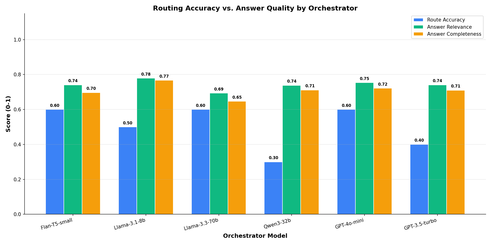
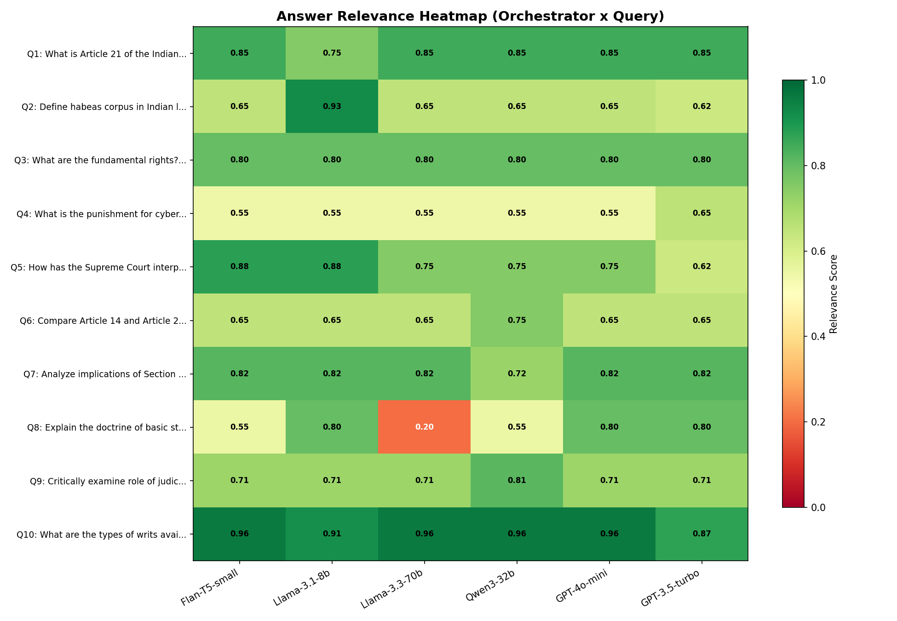
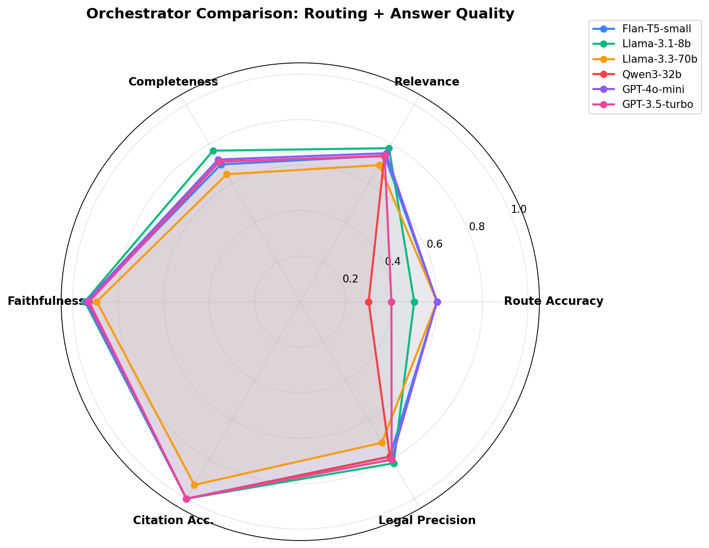
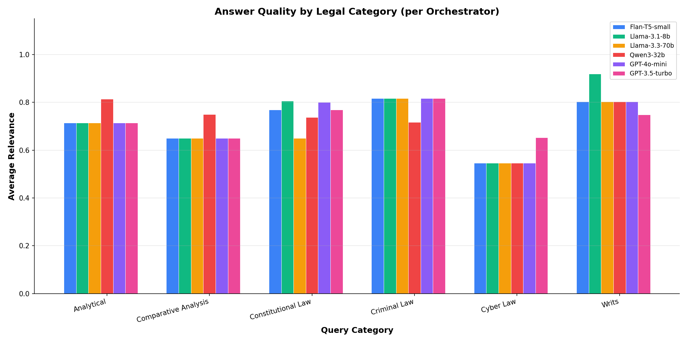

# PEARL Framework -- Orchestration & Answer Quality Report

**Generated**: 2026-04-13 16:53:46  
**Queries**: 10  
**Orchestrator Models Tested**: 6  
**Answering Agent**: Llama-3.1-8b-instant (via Groq, unchanged) (same for all)

## Executive Summary

This report evaluates how different models perform **as orchestrators** in the PEARL framework. 
Each orchestrator classifies queries and determines the agent routing. The **same answering agent** 
(Llama-3.1-8b-instant (via Groq, unchanged)) generates all answers. We measure both **routing accuracy** and **final answer quality** 
to understand how orchestration decisions impact end-to-end performance.

- **Best Routing Accuracy**: Flan-T5-small (60.0%)
- **Best Answer Relevance**: Llama-3.1-8b (0.779)
- **Best Faithfulness**: Llama-3.1-8b (0.946)

## Models Under Evaluation (as Orchestrators)

| Model | Parameters | Type | Provider | Cost/1K tokens |
|-------|-----------|------|----------|---------------|
| Flan-T5-small | 80M | Trained SLM | Local | Free |
| Llama-3.1-8b | 8B | Open-Source SLM | Groq | Free |
| Llama-3.3-70b | 70B | Open-Source LLM | Groq | Free |
| Qwen3-32b | 32B | Open-Source LLM | Groq | Free |
| GPT-4o-mini | ~8B | Commercial LLM | Openai | $0.15 |
| GPT-3.5-turbo | ~175B | Commercial LLM | Openai | $0.50 |

## Combined Results: Routing + Answer Quality

| Orchestrator | Route Acc. | RAS | WAI | Exact% | Relevance | Complete. | Faithful. | Citation | Halluc. | Legal Pr. | Avg Len | Orch Lat. | Pipe Lat. |
|-------------|-----------|-----|-----|--------|-----------|----------|----------|---------|---------|----------|---------|----------|----------|
| **Llama-3.1-8b** | 50.0% | 0.808 | 0.708 | 40.0% | 0.779 | 0.767 | 0.946 | 1.000 | 0.000 | 0.820 | 478 | 502ms | 8881ms |
| **GPT-4o-mini** | 60.0% | 0.908 | 0.853 | 70.0% | 0.753 | 0.722 | 0.940 | 1.000 | 0.000 | 0.801 | 507 | 910ms | 10680ms |
| **Flan-T5-small** | 60.0% | 0.942 | 0.860 | 80.0% | 0.741 | 0.697 | 0.936 | 1.000 | 0.000 | 0.786 | 486 | 128ms | 9760ms |
| **GPT-3.5-turbo** | 40.0% | 0.800 | 0.627 | 40.0% | 0.741 | 0.710 | 0.927 | 1.000 | 0.033 | 0.802 | 467 | 780ms | 10369ms |
| **Qwen3-32b** | 30.0% | 0.800 | 0.625 | 50.0% | 0.739 | 0.712 | 0.936 | 1.000 | 0.000 | 0.787 | 478 | 151ms | 8870ms |
| **Llama-3.3-70b** | 60.0% | 0.892 | 0.822 | 70.0% | 0.694 | 0.647 | 0.894 | 0.930 | 0.000 | 0.716 | 462 | 197ms | 9188ms |

## Visualization

### Routing Accuracy vs. Answer Quality

### Answer Relevance Heatmap (Orchestrator x Query)

### Multi-Dimensional Radar Chart

### Performance by Legal Category

## Routing Decision Matrix

| Query | Flan-T5-small | Llama-3.1-8b | Llama-3.3-70b | Qwen3-32b | GPT-4o-mini | GPT-3.5-turbo | Expected |
|-------|------|------|------|------|------|------|----------|
| Q1: What is Article 21 of the Indi... | simple (Y) | verified (N) | simple (Y) | simple (Y) | simple (Y) | simple (Y) | simple |
| Q2: Define habeas corpus in Indian... | simple (Y) | verified (N) | simple (Y) | simple (Y) | simple (Y) | enhanced (N) | simple |
| Q3: What are the fundamental right... | simple (Y) | verified (N) | simple (Y) | simple (Y) | simple (Y) | enhanced (N) | simple |
| Q4: What is the punishment for cyb... | verified (Y) | verified (Y) | simple (N) | simple (N) | simple (N) | enhanced (N) | verified |
| Q5: How has the Supreme Court inte... | verified (Y) | verified (Y) | full_pipeline (N) | simple (N) | full_pipeline (N) | enhanced (N) | verified |
| Q6: Compare Article 14 and Article... | verified (N) | enhanced (Y) | enhanced (Y) | simple (N) | enhanced (Y) | enhanced (Y) | enhanced |
| Q7: Analyze implications of Sectio... | verified (N) | full_pipeline (Y) | full_pipeline (Y) | simple (N) | full_pipeline (Y) | full_pipeline (Y) | full_pipeline |
| Q8: Explain the doctrine of basic ... | simple (N) | enhanced (N) | full_pipeline (N) | simple (N) | enhanced (N) | enhanced (N) | verified |
| Q9: Critically examine role of jud... | full_pipeline (Y) | enhanced (N) | full_pipeline (Y) | simple (N) | full_pipeline (Y) | full_pipeline (Y) | full_pipeline |
| Q10: What are the types of writs av... | simple (N) | verified (Y) | simple (N) | simple (N) | simple (N) | enhanced (N) | verified |

## Per-Query Detailed Results

### Q1: What is Article 21 of the Indian Constitution?
**Complexity**: simple | **Category**: Constitutional Law | **Expected Route**: simple

| Orchestrator | Route | Correct? | Relevance | Complete. | Faithful. | Halluc. | Length |
|-------------|-------|----------|-----------|----------|----------|---------|--------|
| Flan-T5-small | simple | Yes | 0.850 | 1.000 | 1.000 | 0.000 | 385 |
| Llama-3.3-70b | simple | Yes | 0.850 | 1.000 | 1.000 | 0.000 | 385 |
| Qwen3-32b | simple | Yes | 0.850 | 1.000 | 1.000 | 0.000 | 385 |
| GPT-4o-mini | simple | Yes | 0.850 | 1.000 | 1.000 | 0.000 | 385 |
| GPT-3.5-turbo | simple | Yes | 0.850 | 1.000 | 1.000 | 0.000 | 385 |
| Llama-3.1-8b | verified | No | 0.750 | 0.800 | 0.964 | 0.000 | 379 |

**Best Answer** (Orchestrated by Flan-T5-small, route: simple):
> **Legal Provisions:** Article 21 of the Indian Constitution [doc_1], which states: "No person shall be deprived of his life or personal liberty except according to procedure established by law."

**Key Points:** Article 21 is a fundamental right that protects the right to life and personal liberty of every individual in India. It is considered one ...

### Q2: Define habeas corpus in Indian law
**Complexity**: simple | **Category**: Writs | **Expected Route**: simple

| Orchestrator | Route | Correct? | Relevance | Complete. | Faithful. | Halluc. | Length |
|-------------|-------|----------|-----------|----------|----------|---------|--------|
| Llama-3.1-8b | verified | No | 0.925 | 1.000 | 1.000 | 0.000 | 476 |
| Flan-T5-small | simple | Yes | 0.650 | 0.600 | 0.904 | 0.000 | 817 |
| Llama-3.3-70b | simple | Yes | 0.650 | 0.600 | 0.904 | 0.000 | 817 |
| Qwen3-32b | simple | Yes | 0.650 | 0.600 | 0.904 | 0.000 | 817 |
| GPT-4o-mini | simple | Yes | 0.650 | 0.600 | 0.904 | 0.000 | 817 |
| GPT-3.5-turbo | enhanced | No | 0.625 | 0.400 | 0.711 | 0.333 | 482 |

**Best Answer** (Orchestrated by Llama-3.1-8b, route: verified):
> **Legal Provisions:**

The concept of habeas corpus in Indian law is rooted in Article 21 of the Constitution of India, which guarantees the right to life and personal liberty. The writ of habeas corpus is a remedy available to a person who is detained or imprisoned without lawful authority. The Supreme Court of India has recognized the writ of hab...

### Q3: What are the fundamental rights?
**Complexity**: simple | **Category**: Constitutional Law | **Expected Route**: simple

| Orchestrator | Route | Correct? | Relevance | Complete. | Faithful. | Halluc. | Length |
|-------------|-------|----------|-----------|----------|----------|---------|--------|
| Flan-T5-small | simple | Yes | 0.800 | 1.000 | 1.000 | 0.000 | 449 |
| Llama-3.1-8b | verified | No | 0.800 | 1.000 | 1.000 | 0.000 | 477 |
| Llama-3.3-70b | simple | Yes | 0.800 | 1.000 | 1.000 | 0.000 | 449 |
| Qwen3-32b | simple | Yes | 0.800 | 1.000 | 1.000 | 0.000 | 449 |
| GPT-4o-mini | simple | Yes | 0.800 | 1.000 | 1.000 | 0.000 | 449 |
| GPT-3.5-turbo | enhanced | No | 0.800 | 1.000 | 1.000 | 0.000 | 427 |

**Best Answer** (Orchestrated by Flan-T5-small, route: simple):
> **Fundamental Rights in India**

**Legal Provisions:** Article 14 to 35 of the Constitution of India, 1950 [Constitution of India, 1950]

The fundamental rights in India are enshrined in Part III of the Constitution of India, 1950. These rights are guaranteed to all citizens of India and are considered essential for the well-being and dignity of in...

### Q4: What is the punishment for cybercrime under IT Act 2000?
**Complexity**: moderate | **Category**: Cyber Law | **Expected Route**: verified

| Orchestrator | Route | Correct? | Relevance | Complete. | Faithful. | Halluc. | Length |
|-------------|-------|----------|-----------|----------|----------|---------|--------|
| GPT-3.5-turbo | enhanced | No | 0.653 | 0.667 | 0.940 | 0.000 | 474 |
| Flan-T5-small | verified | Yes | 0.547 | 0.333 | 0.832 | 0.000 | 439 |
| Llama-3.1-8b | verified | Yes | 0.547 | 0.333 | 0.832 | 0.000 | 439 |
| Llama-3.3-70b | simple | No | 0.547 | 0.333 | 0.808 | 0.000 | 375 |
| Qwen3-32b | simple | No | 0.547 | 0.333 | 0.808 | 0.000 | 375 |
| GPT-4o-mini | simple | No | 0.547 | 0.333 | 0.808 | 0.000 | 375 |

**Best Answer** (Orchestrated by GPT-3.5-turbo, route: enhanced):
> **Legal Provisions:**

The Information Technology Act, 2000 (IT Act 2000) is the primary legislation governing cybercrime in India. The Act prescribes various punishments for different types of cybercrimes. 

Section 65 of the IT Act 2000 states that whoever commits cyber terrorism shall be punished with imprisonment for a term which may extend to ...

### Q5: How has the Supreme Court interpreted Article 32?
**Complexity**: moderate | **Category**: Constitutional Law | **Expected Route**: verified

| Orchestrator | Route | Correct? | Relevance | Complete. | Faithful. | Halluc. | Length |
|-------------|-------|----------|-----------|----------|----------|---------|--------|
| Flan-T5-small | verified | Yes | 0.875 | 0.750 | 0.955 | 0.000 | 401 |
| Llama-3.1-8b | verified | Yes | 0.875 | 0.750 | 0.955 | 0.000 | 401 |
| Llama-3.3-70b | full_pipeline | No | 0.750 | 0.500 | 0.910 | 0.000 | 455 |
| Qwen3-32b | simple | No | 0.750 | 0.500 | 0.910 | 0.000 | 433 |
| GPT-4o-mini | full_pipeline | No | 0.750 | 0.500 | 0.910 | 0.000 | 455 |
| GPT-3.5-turbo | enhanced | No | 0.625 | 0.250 | 0.865 | 0.000 | 344 |

**Best Answer** (Orchestrated by Flan-T5-small, route: verified):
> **Legal Provisions:** Article 32 of the Indian Constitution, which states: "The right to move the Supreme Court by appropriate proceedings for the enforcement of the rights conferred by this Part is guaranteed."

**Key Points:** The Supreme Court has interpreted Article 32 as a fundamental right that enables individuals to approach the Supreme Cour...

### Q6: Compare Article 14 and Article 21
**Complexity**: complex | **Category**: Comparative Analysis | **Expected Route**: enhanced

| Orchestrator | Route | Correct? | Relevance | Complete. | Faithful. | Halluc. | Length |
|-------------|-------|----------|-----------|----------|----------|---------|--------|
| Qwen3-32b | simple | No | 0.750 | 0.800 | 0.964 | 0.000 | 455 |
| Flan-T5-small | verified | No | 0.650 | 0.600 | 0.928 | 0.000 | 436 |
| Llama-3.1-8b | enhanced | Yes | 0.650 | 0.600 | 0.928 | 0.000 | 608 |
| Llama-3.3-70b | enhanced | Yes | 0.650 | 0.600 | 0.928 | 0.000 | 608 |
| GPT-4o-mini | enhanced | Yes | 0.650 | 0.600 | 0.928 | 0.000 | 608 |
| GPT-3.5-turbo | enhanced | Yes | 0.650 | 0.600 | 0.928 | 0.000 | 608 |

**Best Answer** (Orchestrated by Qwen3-32b, route: simple):
> **Legal Provisions:**

Article 14 of the Indian Constitution states: "The State shall not deny to any person equality before the law or the equal protection of the laws within the territory of India." [Constitution of India, Article 14]

Article 21 of the Indian Constitution states: "No person shall be deprived of his life or personal liberty excep...

### Q7: Analyze implications of Section 498A IPC on matrimonial disputes
**Complexity**: complex | **Category**: Criminal Law | **Expected Route**: full_pipeline

| Orchestrator | Route | Correct? | Relevance | Complete. | Faithful. | Halluc. | Length |
|-------------|-------|----------|-----------|----------|----------|---------|--------|
| Flan-T5-small | verified | No | 0.817 | 0.833 | 0.970 | 0.000 | 415 |
| Llama-3.1-8b | full_pipeline | Yes | 0.817 | 0.833 | 0.970 | 0.000 | 427 |
| Llama-3.3-70b | full_pipeline | Yes | 0.817 | 0.833 | 0.970 | 0.000 | 427 |
| GPT-4o-mini | full_pipeline | Yes | 0.817 | 0.833 | 0.970 | 0.000 | 427 |
| GPT-3.5-turbo | full_pipeline | Yes | 0.817 | 0.833 | 0.970 | 0.000 | 427 |
| Qwen3-32b | simple | No | 0.717 | 0.833 | 0.970 | 0.000 | 439 |

**Best Answer** (Orchestrated by Flan-T5-small, route: verified):
> **Legal Provisions:**

- Section 498A of the Indian Penal Code (IPC) [General Knowledge]
- The Protection of Women from Domestic Violence Act, 2005 [General Knowledge]
- The Code of Criminal Procedure, 1973 (CrPC) [General Knowledge]

**Key Points:**

Section 498A IPC is a criminal provision that deals with the offense of husband or relative of hus...

### Q8: Explain the doctrine of basic structure
**Complexity**: moderate | **Category**: Constitutional Law | **Expected Route**: verified

| Orchestrator | Route | Correct? | Relevance | Complete. | Faithful. | Halluc. | Length |
|-------------|-------|----------|-----------|----------|----------|---------|--------|
| Llama-3.1-8b | enhanced | No | 0.800 | 0.750 | 0.955 | 0.000 | 517 |
| GPT-4o-mini | enhanced | No | 0.800 | 0.750 | 0.955 | 0.000 | 517 |
| GPT-3.5-turbo | enhanced | No | 0.800 | 0.750 | 0.955 | 0.000 | 517 |
| Flan-T5-small | simple | No | 0.550 | 0.250 | 0.841 | 0.000 | 479 |
| Qwen3-32b | simple | No | 0.550 | 0.250 | 0.841 | 0.000 | 479 |
| Llama-3.3-70b | full_pipeline | No | 0.200 | 0.000 | 0.490 | 0.000 | 59 |

**Best Answer** (Orchestrated by Llama-3.1-8b, route: enhanced):
> **Legal Provisions:** 
The doctrine of basic structure is not explicitly mentioned in the Indian Constitution, but it has been recognized and applied by the Supreme Court of India through various judgments. The key provisions that underlie this doctrine are:

- Article 13(2) of the Indian Constitution, which states that any law that is inconsistent...

### Q9: Critically examine role of judiciary in protecting civil liberties
**Complexity**: complex | **Category**: Analytical | **Expected Route**: full_pipeline

| Orchestrator | Route | Correct? | Relevance | Complete. | Faithful. | Halluc. | Length |
|-------------|-------|----------|-----------|----------|----------|---------|--------|
| Qwen3-32b | simple | No | 0.814 | 0.800 | 0.964 | 0.000 | 502 |
| Flan-T5-small | full_pipeline | Yes | 0.714 | 0.600 | 0.928 | 0.000 | 593 |
| Llama-3.1-8b | enhanced | No | 0.714 | 0.600 | 0.928 | 0.000 | 532 |
| Llama-3.3-70b | full_pipeline | Yes | 0.714 | 0.600 | 0.928 | 0.000 | 593 |
| GPT-4o-mini | full_pipeline | Yes | 0.714 | 0.600 | 0.928 | 0.000 | 593 |
| GPT-3.5-turbo | full_pipeline | Yes | 0.714 | 0.600 | 0.928 | 0.000 | 593 |

**Best Answer** (Orchestrated by Qwen3-32b, route: simple):
> **Legal Provisions:**

- Article 13(1) of the Indian Constitution, which states that "all laws in force in the territory of India immediately before the commencement of this Constitution, in so far as they are inconsistent with the provisions of Part III, shall, to the extent of such inconsistency, be void."
- Article 32 of the Indian Constitution,...

### Q10: What are the types of writs available under Indian Constitution?
**Complexity**: moderate | **Category**: Writs | **Expected Route**: verified

| Orchestrator | Route | Correct? | Relevance | Complete. | Faithful. | Halluc. | Length |
|-------------|-------|----------|-----------|----------|----------|---------|--------|
| Flan-T5-small | simple | No | 0.957 | 1.000 | 1.000 | 0.000 | 447 |
| Llama-3.3-70b | simple | No | 0.957 | 1.000 | 1.000 | 0.000 | 447 |
| Qwen3-32b | simple | No | 0.957 | 1.000 | 1.000 | 0.000 | 447 |
| GPT-4o-mini | simple | No | 0.957 | 1.000 | 1.000 | 0.000 | 447 |
| Llama-3.1-8b | verified | Yes | 0.914 | 1.000 | 0.928 | 0.000 | 524 |
| GPT-3.5-turbo | enhanced | No | 0.871 | 1.000 | 0.976 | 0.000 | 415 |

**Best Answer** (Orchestrated by Flan-T5-small, route: simple):
> **Legal Provisions:**

The types of writs available under the Indian Constitution are primarily governed by Articles 32 and 226. Article 32 empowers the Supreme Court to issue writs for the enforcement of fundamental rights, while Article 226 grants similar powers to the High Courts. The writs available under these provisions are:

- **Habeas Corpu...

## Key Findings

### 1. Routing Accuracy Impact on Answer Quality
- Flan-T5-small achieved 60% routing accuracy.
- Llama-3.1-8b delivered the best answer relevance (0.779).
- Correct routing leads to better answers by involving the right agents (booster, verifier) when needed.

### 2. PEARL SLM Orchestrator Performance
- Flan-T5-small (80M) achieves 60% routing accuracy with 128ms latency.
- Answer quality: Relevance=0.741, Completeness=0.697
- As a free, local model, it provides the best cost-performance trade-off for orchestration.

### 3. Cost-Performance Analysis
- Best free orchestrator: **Llama-3.1-8b** (Relevance: 0.779, Route Acc: 50%)
- Best paid orchestrator: **GPT-4o-mini** (Relevance: 0.753, Route Acc: 60%)
- Free open-source models via Groq API are competitive with commercial alternatives.

### 4. Key Takeaway
- The **orchestrator choice directly impacts final answer quality**, even though the answering agent remains the same.
- Correct routing ensures appropriate context enhancement (booster) and verification (verifier) for complex queries.
- PEARL's Flan-T5-small SLM provides effective orchestration at zero cost and minimal latency.

## Methodology

- **Answering Agent**: Llama-3.1-8b-instant (via Groq, unchanged) (unchanged across all configurations)
- **Orchestration Task**: Classify each query into simple/verified/enhanced/full_pipeline
- **Pipeline**: Actual agent pipeline executed (booster, retriever, answering, verifier)
- **Caching**: Pipeline results cached per (query, route) to avoid redundant runs
- **Metrics**: Routing (RAS, WAI, Exact Match) + Answer Quality (Relevance, Completeness, Faithfulness, Citation, Hallucination, Legal Precision)

---
*Report generated by PEARL Framework Evaluation Suite*